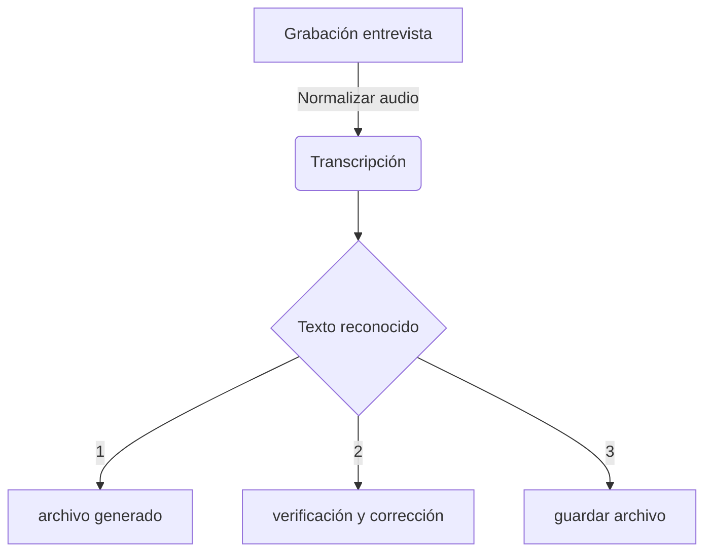

```mermaid
flowchart TD
    A[Grabación entrevista] -->|Normalizar audio| B(Transcripción)
    B --> C{Texto reconocido}
    C -->|1| D[archivo generado]
    C -->|2| E[verificación y corrección]
    C -->|3| F[guardar archivo]
```
